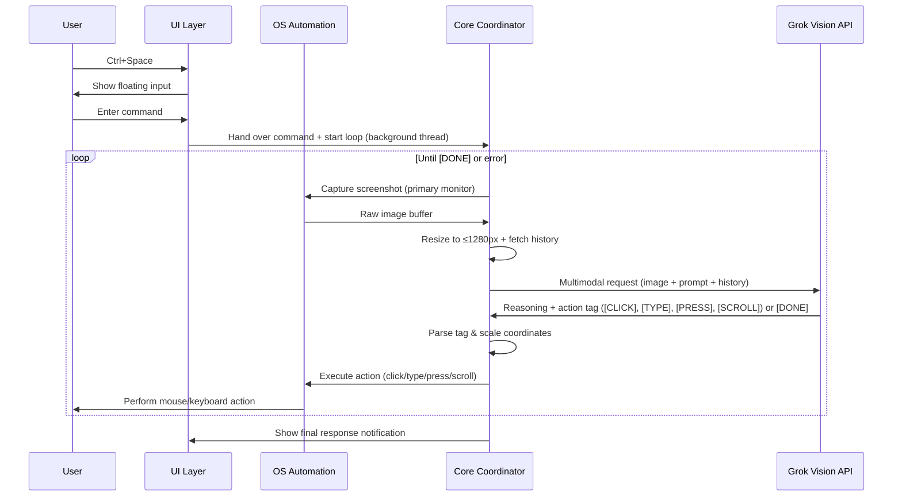

# High-Level Design (HLD): Local Desktop Automation Agent with Grok Vision

**Version:** 1.5 (Incorporated: Normalized coordinates 0-1000, [TYPE:x,y|text] delimiter, clipboard safety with delay, failsafe loop termination, background worker thread, physical DPI-aware input via pynput/ctypes)  
**Date:** June 2026  
**Purpose:** Enable natural language control of the desktop using Grok's multimodal vision capabilities for real-time screen understanding and precise action execution.

---

## 1. System Overview

This project creates a lightweight, local desktop agent that allows users to control their computer using natural language commands (e.g., "Click the blue login button", "Open Chrome and search for weather, then press Enter", "Scroll down to Settings").

The agent combines:
- **Local UI** for quick input
- **Screen capture & automation**
- **Grok Vision API** for intelligent spatial reasoning
- **Local state management** with conversation history

**Key Constraints:**
- Strictly single-monitor Windows OS
- **Default baseline: 1080p (1920x1080)**
- Maximum resolution: 1440p (2560x1440)
- Multi-step autonomous execution loop until task completion

---

## 2. Architecture Diagram

```mermaid
flowchart TD
    subgraph User["User Desktop / OS (Windows)"]
        Hotkey[Hotkey Trigger Ctrl+Space]
        UI[Component 1: UI Layer\n- Floating Spotlight Input\n- PyQt6 + Hotkey Thread]
        OS[Component 2: OS Automation\n- mss Screenshot (Primary Monitor)\n- pynput / ctypes Input Emulator]
        Coord[Component 3: Core Coordinator\n- SQLite DB (History)\n- Image Resizer\n- Parser\n- Background Worker Thread]
        AI[Component 4: AI Engine\n- Grok Vision API\n- Spatial Reasoning + History]
    end

    Hotkey --> UI
    UI -->|"User Command"| Coord
    Coord -->|"Screenshot + History Context"| AI
    AI -->|"Reasoning + Action Tag / [DONE]"| Coord
    Coord --> OS
    OS -->|"Mouse/Keyboard Actions"| User
    Coord -.->|"Loop until DONE"| AI
    UI <-->|"Coordinates / State / Abort"| OS
```

This Mermaid diagram shows the layered architecture with the iterative execution loop running in a background thread.

---

## 3. Data Flow Pipeline



The sequence illustrates the **continuous multi-step loop** that repeats capture-reason-execute until the AI signals completion with `[DONE]`. The loop runs in a background thread.

---

## 4. Component Specifications

### Component 1: UI Layer (Floating Spotlight)
- **Tech:** PyQt6 + pynput
- **Features:**
  - Global hotkey (`Ctrl+Space`)
  - Centered floating input
  - Modern blurred, borderless design
  - Immediate hide on submission
  - Emergency abort hook (e.g., hold `Esc`)
- **Key Variables:** `window_visible`, `current_input_text`
- **Critical:** Use thread-safe `pyqtSignal` for all GUI operations from hotkey listener and from the background coordinator thread.

### Component 2: OS Automation Layer
- **Tech:** `mss` (screen capture) + **pynput.mouse.Controller** / **ctypes.windll.user32** + pyperclip
- **Capabilities:**
  - Primary monitor screenshot only (Monitor 0)
  - `click_at(x, y)` with smooth movement (using pynput or SetCursorPos)
  - `type_string(text)`: **Clipboard-safe context manager** with explicit delay
  - `press_key(key_name)` (e.g., "enter", "tab", "backspace")
  - `scroll(direction, amount)`
  - Browser control via `webbrowser`
- **Windows-Specific:**
  - Initialize DPI awareness: `ctypes.windll.shcore.SetProcessDpiAwareness(2)`
  - Use **physical pixel coordinates** for all mouse actions (bypassing PyAutoGUI scaling issues)
  - Enable `pyautogui.FAILSAFE = True` (for compatibility + visual indicator only)
- **Key Variables:** Cursor position, physical screen dimensions

**Clipboard Context Manager Fix:**
```python
def type_string(self, text):
    original = pyperclip.paste()
    try:
        pyperclip.copy(text)
        with keyboard.pressed(Key.ctrl):
            keyboard.press('v')
            keyboard.release('v')
        time.sleep(0.1)  # Critical delay for Windows paste processing
    finally:
        pyperclip.copy(original)
```

> Use `pynput.keyboard.Controller` for paste handling to avoid mixing PyAutoGUI keyboard events with `pynput` global hotkeys.

### Component 3: Core Coordinator
- **Tech:** Python 3.10+, sqlite3, Pillow (PIL), re, **QThread** (or threading.Thread)
- **Responsibilities:**
  - Image resizing with aspect ratio preservation
  - Scale factor tracking for coordinate remapping **(from normalized 0-1000 grid)**
  - SQLite interaction history (for context to Grok)
  - Build multi-turn message history for API payload **(text-only for past turns)**
  - Payload construction & response parsing
  - Orchestrate the execution loop **in a background worker thread** until `[DONE]` with hard `MAX_STEPS=12`
  - **Failsafe exception handling** that fully terminates the loop and signals UI

**Coordinate Math (Normalized Grid - Physical Pixels):**
```math
scale_x = screen_physical_width / 1000
scale_y = screen_physical_height / 1000
final_physical_x = grok_x * scale_x
final_physical_y = grok_y * scale_y
```

**Failsafe Fix:**
```python
try:
    execute_action(...)
except pyautogui.FailSafeException:
    # This should be rare in our setup; actual emergency abort is driven by the pynput Esc listener.
    self.is_running = False
    self.abort_signal.emit()  # Notify UI to show window / stop
    logger.info("Compatibility failsafe triggered - execution aborted")
    break
```

> The `Esc` key hook is the primary tripwire for stopping the loop; PyAutoGUI failsafe is only a secondary compatibility indicator when PyAutoGUI functions happen to run.

### Component 4: AI Engine (Grok Vision)
- **Endpoint:** `https://api.x.ai/v1/chat/completions`
- **Model:** `grok-2-vision-latest` (or latest multimodal)
- **Payload:** Multi-turn messages array. **Only the final user message contains the current Base64 screenshot**. All previous history entries are text-only summaries of actions and results.

---

## 5. System Prompt for Grok Vision

```markdown
You are the visual intelligence core of a local desktop automation agent.

You receive a downscaled screenshot (max 1280px dimension) of the user's entire Windows desktop.

**Rules:**
- Use a **normalized coordinate grid** from 0 to 1000: Top-left is (0,0), bottom-right is (1000,1000). This makes precise targeting easier.
- Be extremely precise with coordinates on this grid.
- Always reason step-by-step about the visible UI
- Review conversation history for previous actions and outcomes
- At the END of your response, output exactly ONE action tag if more interaction is needed:

[CLICK:x,y]          → Click at normalized coordinates
[TYPE:x,y|text_to_type]      → Focus field at normalized x,y then type the text after |
[PRESS:key_name]     → Press a specific key (enter, tab, backspace, escape, etc.)
[SCROLL:direction:amount] → Scroll (e.g. down:300 or down:3 for pages)
[DONE]               → Task completed, no further action needed

If the user's objective is fully achieved or you need to respond conversationally, end with [DONE] after your text response.
If an element is off-screen, use SCROLL first.
If an action appears to have failed based on history, try an alternative approach (including waiting via small repeated actions).
```

---

## 6. Edge Cases & Implementation Notes

- **DPI Awareness:** Explicitly set via `ctypes`. Use pynput/ctypes for reliable physical coordinate input.
- **Timing:** **250ms** delay after hiding UI before screenshot (configurable).
- **Threading:** Coordinator loop **must** run on a background `QThread`/`Thread` to keep UI responsive and abort hooks functional.
- **Error Handling:** Graceful fallback if API fails or coordinates invalid. Hard loop limit of 12 steps per command. **Esc key abort is the primary stop signal; FailSafeException is only a compatibility fallback when PyAutoGUI functions execute.**
- **Security:** Local-only execution, API key stored securely (e.g. environment variable).
- **Windows Safeguards:** Run the application/terminal **as Administrator** (UAC elevation). PyAutoGUI failsafe enabled as visual cue only.
- **Clipboard Safety:** Input emulator must backup/restore user's clipboard **with 100ms delay** after paste.
- **Context Management:** Recent interaction logs (text summaries only) injected into each Grok payload. **Never include previous Base64 images** in history.

---

## 7. Critical Windows Timing & Input Normalization Fixes

### 7.1 The Click-to-Type Timing Gap (Phase 3)

Your action tag `[TYPE:x,y|text]` instructs the agent to click the coordinates to focus the field, and then type.

- **The Catch:** On Windows, when switching focus between windows or activating an input field, the OS takes a handful of milliseconds to register the focus change and draw the cursor inside the field. If the script fires the `pynput` typing commands immediately after the click event, the first 2 to 4 characters of the text will often get dropped into a void.
- **The Safeguard:** Tell your LLM to implement a minor, hardcoded sleep delay (e.g., `time.sleep(0.15)`) immediately *after* the mouse click and *before* executing the paste/typing operation.

**Implementation in `type_string()` with Click:**
```python
def type_at_coordinates(self, x, y, text):
    """Click to focus field, then type with safety delay."""
    self.click_at(x, y)
    time.sleep(0.15)  # Critical Windows focus registration delay
    self.type_string(text)
```

### 7.2 Scroll Unit Normalization (Phase 3 & Phase 5)

Your prompt design tells Grok it can issue commands like `[SCROLL:down:300]` (implicitly meaning pixels) or `[SCROLL:down:3]` (meaning pages).

- **The Catch:** `pynput.mouse.Controller().scroll(dx, dy)` interprets the integers as **wheel clicks/steps**, not physical pixels. On Windows, a single scroll wheel step (`dy=-1`) typically moves the screen down by 3 lines of text or roughly 30–50 pixels depending on system settings. Passing `300` directly into `pynput.scroll(0, -300)` will send the page flying down thousands of rows instantly.
- **The Safeguard:** In Phase 3, make sure the input emulator translates Grok's scale. A safe baseline translation for the execution layer is:
  - If Grok says `[SCROLL:down:3]`, execute `mouse.scroll(0, -3)`.
  - If Grok treats it like pixels (e.g., `300`), divide it by a factor of ~50 before passing it to `pynput` to prevent over-scrolling.

**Implementation in `scroll()` Method:**
```python
def scroll(self, direction, amount):
    """
    Execute scroll with intelligent unit detection.
    
    - If amount ≤ 10: treat as wheel clicks (pass directly to pynput).
    - If amount > 10: treat as pixels (divide by ~50 to normalize).
    """
    if amount <= 10:
        # Direct wheel clicks
        scroll_steps = amount if direction == "down" else -amount
    else:
        # Pixel units — normalize to wheel clicks
        scroll_steps = (amount // 50) if direction == "down" else -(amount // 50)
    
    mouse = pynput.mouse.Controller()
    mouse.scroll(0, scroll_steps)
```

---

## 8. Next Steps for Implementation

1. Set up virtual environment and install dependencies (`PyQt6`, `mss`, `pillow`, `pyautogui`, `pynput`, `httpx`, `pyperclip`)
2. Implement components in order: UI → Automation → Coordinator → API integration, with threading and physical coordinates.
3. Test coordinate accuracy on Windows 1080p displays with common scalings (100%, 125%, 150%)
4. Add safety features (confirmation for destructive actions)

This HLD provides a clear, production-oriented blueprint for building a powerful Grok-powered desktop agent optimized for single-monitor Windows environments.
