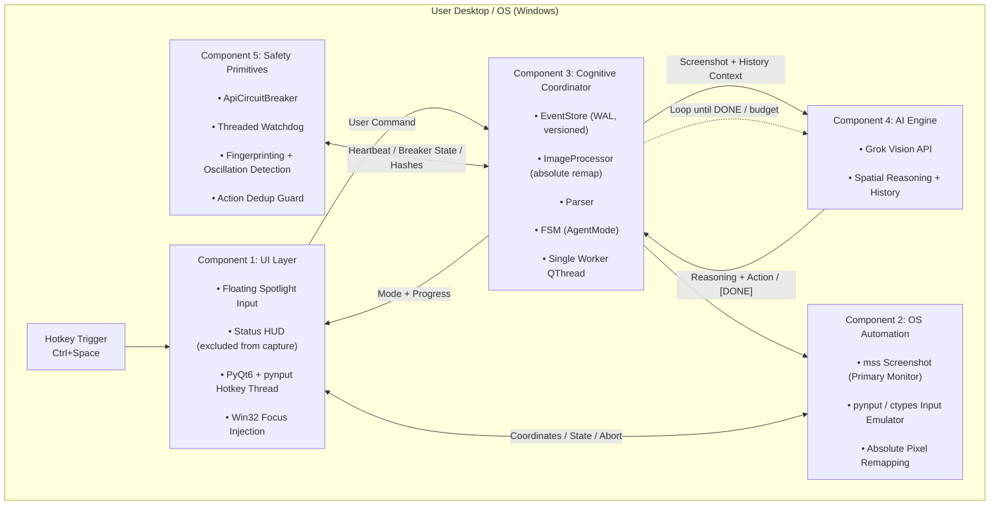
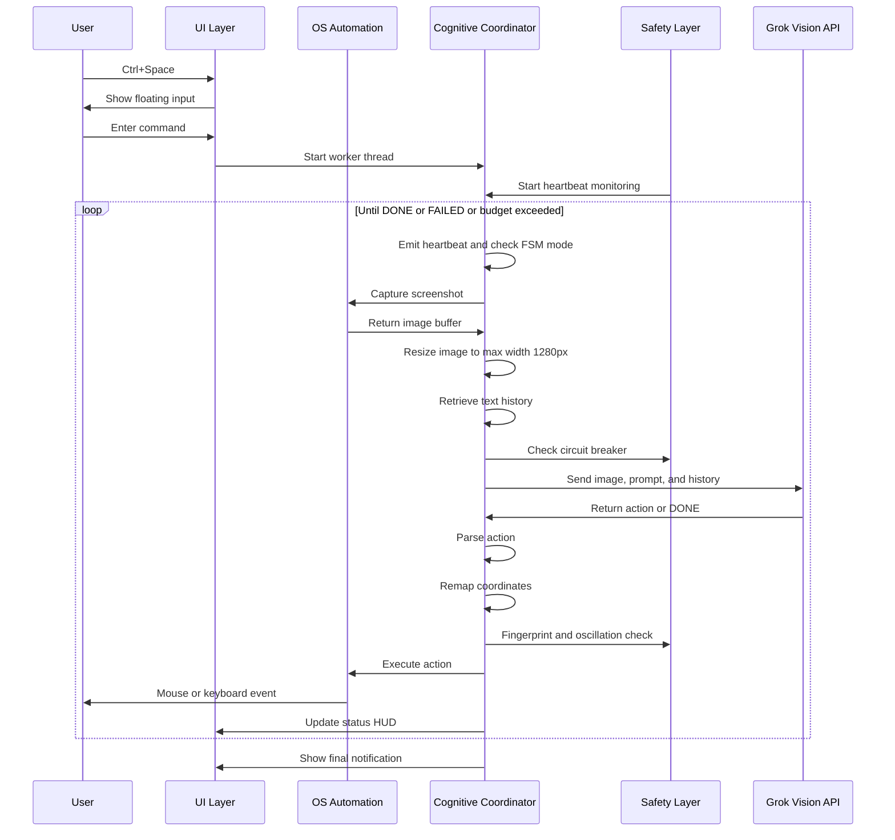

# High-Level Design (HLD): Local Desktop Automation Agent

## 1. System Overview

This project creates a lightweight, local desktop agent that allows users to control their computer using natural language commands (e.g., "Click the blue login button", "Open Chrome and search for weather, then press Enter", "Scroll down to Settings").

The agent combines:
- **Local UI** for quick input (Spotlight) plus a non-intrusive **Status HUD** overlay
- **Screen capture & automation**
- **Grok Vision API** for intelligent spatial reasoning
- **Local state management** with a versioned, append-only EventStore and crash recovery
- **A hardened cognitive execution engine** governed by a finite-state machine with independent watchdog supervision

**Key Constraints:**
- Strictly single-monitor Windows OS
- **Default baseline: 1080p (1920x1080)**
- Maximum resolution: 1440p (2560x1440)
- Multi-step autonomous execution loop until task completion, bounded by hard budgets

> **Coordinate Resolution Note:** To maintain absolute alignment with the visual processing behavior of modern vision models and resolve underlying configuration contradictions, the entire system uses **absolute scaled-image pixel positions** (top-left = `0,0`) emitted by the model. These are mapped back onto physical display coordinates by the `ImageProcessor` layer using stored `scale_x` / `scale_y` values.

---

## 2. Architecture Diagram


```mermaid
flowchart TD
    subgraph UserDesktop["User Desktop / OS (Windows)"]
        Hotkey["Hotkey Trigger<br/>Ctrl+Space"]

        UI["Component 1: UI Layer<br/>
        • Floating Spotlight Input<br/>
        • Status HUD (excluded from capture)<br/>
        • PyQt6 + pynput Hotkey Thread<br/>
        • Win32 Focus Injection"]

        OS["Component 2: OS Automation<br/>
        • mss Screenshot (Primary Monitor)<br/>
        • pynput / ctypes Input Emulator<br/>
        • Absolute Pixel Remapping"]

        Coord["Component 3: Cognitive Coordinator<br/>
        • EventStore (WAL, versioned)<br/>
        • ImageProcessor (absolute remap)<br/>
        • Parser<br/>
        • FSM (AgentMode)<br/>
        • Single Worker QThread"]

        AI["Component 4: AI Engine<br/>
        • Grok Vision API<br/>
        • Spatial Reasoning + History"]

        Safety["Component 5: Safety Primitives<br/>
        • ApiCircuitBreaker<br/>
        • Threaded Watchdog<br/>
        • Fingerprinting + Oscillation Detection<br/>
        • Action Dedup Guard"]
    end

    Hotkey --> UI
    UI -->|"User Command"| Coord
    Coord -->|"Screenshot + History Context"| AI
    AI -->|"Reasoning + Action / [DONE]"| Coord
    Coord --> OS
    Coord -.->|"Loop until DONE / budget"| AI
    Safety <-->|"Heartbeat / Breaker State / Hashes"| Coord
    Coord -->|"Mode + Progress"| UI
    UI <-->|"Coordinates / State / Abort"| OS
```

This Mermaid diagram shows the layered architecture with the iterative execution loop running in a single background worker thread, supervised by an independent safety layer.

---

## 3. Data Flow Pipeline


```mermaid
sequenceDiagram
    participant User
    participant UI as UI Layer
    participant OS as OS Automation
    participant Core as Cognitive Coordinator
    participant Safety as Safety Layer
    participant Grok as Grok Vision API

    User->>UI: Ctrl+Space
    UI->>User: Show floating input
    User->>UI: Enter command
    UI->>Core: Start worker thread
    Safety->>Core: Start heartbeat monitoring

    loop Until DONE or FAILED or budget exceeded
        Core->>Core: Emit heartbeat and check FSM mode
        Core->>OS: Capture screenshot
        OS->>Core: Return image buffer

        Core->>Core: Resize image to max width 1280px
        Core->>Core: Retrieve text history

        Core->>Safety: Check circuit breaker
        Core->>Grok: Send image, prompt, and history

        Grok->>Core: Return action or DONE

        Core->>Core: Parse action
        Core->>Core: Remap coordinates

        Core->>Safety: Fingerprint and oscillation check

        Core->>OS: Execute action
        OS->>User: Mouse or keyboard event

        Core->>UI: Update status HUD
    end

    Core->>UI: Show final notification
```

The sequence illustrates the **continuous multi-step loop** that repeats capture-reason-execute until the AI signals `[DONE]` or a structural budget / safety trip terminates it. The loop runs in a single worker thread and emits a heartbeat consumed by the independent Watchdog.

---

## 4. Component Specifications

### Component 1: UI Layer (Spotlight + Status HUD)
- **Tech:** PyQt6 + pynput + native Win32 APIs
- **Spotlight Features:**
  - Global hotkey (`Ctrl+Space`) via a low-level `pynput` daemon thread
  - Centered, borderless, translucent floating input
  - Immediate hide on submission
  - Emergency abort hook (hold `Esc`)
- **Win32 Focus Injection:** Immediately after layout realization, lock OS input attention using `AttachThreadInput`, `SetForegroundWindow`, and `SetFocus` to mitigate keyboard focus-drop issues.
- **Status HUD (`ui/hud.py`):** A click-through, non-activating floating progress widget showing the current `AgentMode` and step progress. Enforce `SetWindowDisplayAffinity(handle, WDA_EXCLUDEFROMCAPTURE)` on the HUD window so the feedback pill is **systematically removed from desktop screenshots** sent to Grok.
- **Key Variables:** `window_visible`, `current_input_text`
- **Critical:** Use thread-safe `pyqtSignal` for all GUI operations from the hotkey listener and from the background coordinator thread.

### Component 2: OS Automation Layer
- **Tech:** `mss` (screen capture) + **pynput.mouse.Controller** / **ctypes.windll.user32** + pyperclip
- **Capabilities:**
  - Primary monitor screenshot only (Monitor 0), extracted into in-memory arrays
  - `click_at(x, y)` with smooth movement (using pynput or `SetCursorPos`), in **physical pixels**
  - `type_string(text)`: **Clipboard-safe context manager** with explicit delay
  - `type_at_coordinates(x, y, text)`: click-to-focus then type, with mandatory focus delay
  - `press_key(key_name)` (e.g., "enter", "tab", "backspace")
  - `scroll(direction, amount)` with unit normalization
  - Browser control via `webbrowser`
- **Windows-Specific:**
  - Initialize DPI awareness explicitly (see §7)
  - Use **physical pixel coordinates** for all mouse actions (bypassing PyAutoGUI scaling issues)
  - Enable `pyautogui.FAILSAFE = True` (for compatibility + visual indicator only)
- **Key Variables:** Cursor position, physical screen dimensions

**Clipboard Context Manager Fix:**
```python
def type_string(self, text):
    original = pyperclip.paste()
    try:
        pyperclip.copy(text)
        with keyboard.pressed(Key.ctrl):
            keyboard.press('v')
            keyboard.release('v')
        time.sleep(0.1)  # Critical delay for Windows paste processing
    finally:
        pyperclip.copy(original)
```

> Use `pynput.keyboard.Controller` for paste handling to avoid mixing PyAutoGUI keyboard events with `pynput` global hotkeys.

### Component 3: Cognitive Coordinator (FSM)
- **Tech:** Python 3.10+, sqlite3 (WAL), Pillow (PIL), re, hashlib, **QThread**
- **Responsibilities:**
  - Image resizing with aspect ratio preservation; store `ProcessedImage.scale_x` / `scale_y`
  - **Absolute inverse remapping**: decode layout positions from the scaled-down screenshot back into real physical display pixels by dividing against stored scaling values
  - Versioned, append-only EventStore (text-only history for context to Grok)
  - Build multi-turn message history for API payload **(text-only for past turns)**
  - Payload construction & response parsing
  - Orchestrate the execution loop **in a single background worker QThread** until `[DONE]`, bounded by hard budgets
  - Drive all state changes through the **finite-state machine** (`AgentMode`) via `transition_to(target_mode)`
  - Cooperate with the safety layer (heartbeat, circuit breaker, fingerprinting, dedup, oscillation)
  - Crash recovery via `resume_session()`

**Finite-State Machine (`AgentMode`):**
- **NORMAL** — Standard step cycle.
- **LOCAL_RETRY** — Executing local corrective adjustments.
- **REFLECTING** — Self-diagnosing execution stagnation.
- **REPLANNING** — Re-indexing the active subtask tree layout.
- **FINISHED** — Graceful completion.
- **FAILED** — Exceeded internal structural failure budgets.
- **CRASHED** — Watchdog-terminated lockup.

Every transition is forced through `transition_to(target_mode)`, which writes an automated transition record directly into the append-only EventStore table (telemetry tracking).

**Coordinate Math (Absolute Scaled-Image Pixels → Physical Pixels):**
$$
\begin{aligned}
scale_x &= \frac{physical\_width}{processed\_width} \\
scale_y &= \frac{physical\_height}{processed\_height} \\
final\_physical\_x &= grok_x \times scale_x \\
final\_physical\_y &= grok_y \times scale_y
\end{aligned}
$$

> Coordinates are absolute pixels relative to the **scaled image** dimensions and are remapped by `ImageProcessor`.

### Component 4: AI Engine (Grok Vision)
- **Endpoint:** `https://api.x.ai/v1/chat/completions`
- **Model:** `grok-2-vision-latest` (or latest multimodal)
- **Payload:** Multi-turn messages array. **Only the final user message contains the current Base64 screenshot**. All previous history entries are text-only summaries of actions and results.

### Component 5: Safety Primitives (`core/safety.py`)
- **ApiCircuitBreaker:** Tracks structural network errors inside a sliding time window. If exceptions breach `CIRCUIT_BREAKER_FAILURE_THRESHOLD`, the breaker trips to an **OPEN** state for `CIRCUIT_BREAKER_TIMEOUT` (120s) to prevent API burning, then transitions to half-open on the next attempt.
- **Threaded Watchdog:** A dedicated, isolated thread tracking the primary execution loop's heartbeat. If no heartbeat is observed within `WATCHDOG_TIMEOUT`, it triggers `handle_watchdog_crash(...)`, moving the FSM to **CRASHED** and firing emergency UI restoration.
- **Deterministic Fingerprinting:** SHA-256 hash of a normalized failure summary, used to identify recurring failure signatures.
- **Frequency-Based Oscillation Detection:** A bounded aging queue (`deque(maxlen=3)`) of recent failure hashes. If a signature repeats `>= MAX_OSCILLATION_COUNT` times, the FSM transitions to **FAILED** to break infinite loops.
- **Action Deduplication Guard:** Caches the hash of the last successfully executed action block (`self.last_executed_hash`); identical consecutive payloads are dropped to protect runtime state.

**Deterministic Fingerprint:**
```python
def generate_deterministic_fingerprint(self, failure_summary: str) -> str:
    normalized = failure_summary.lower().strip().encode('utf-8')
    return hashlib.sha256(normalized).hexdigest()
```

**Oscillation Trip:**
```python
if self.recent_replan_reasons.count(reason_hash) >= config.MAX_OSCILLATION_COUNT:
    self.transition_to(
        AgentMode.FAILED,
        "Infinite loop oscillation detected via telemetry signature tracking."
    )
    break
```

**Watchdog Crash Handler:**
```python
def handle_watchdog_crash(self, diagnostic_reason: str):
    self.is_running = False
    self.transition_to(AgentMode.CRASHED, context=diagnostic_reason)
    self._event_store.log_event(
        self.current_mode,
        "WATCHDOG_TERMINATION",
        {"error": "Vitality heartbeat failed.", "trace": diagnostic_reason},
    )
    # Fire emergency UI state restorations...
```

> The `Esc` key hook remains the primary user-initiated tripwire; the Watchdog is the autonomous tripwire for lockups; PyAutoGUI failsafe is only a secondary compatibility indicator.

---

## 5. Persistence: Versioned Event Store (`core/event_store.py`)

- **Storage:** SQLite with Write-Ahead Logging (`PRAGMA journal_mode=WAL;`) for atomic, append-only writes and structural forensics.
- **Schema Versioning:** A strict internal `schema_info` validation checkpoint tracks `STATE_SCHEMA_VERSION = 1`; startup validates compatibility.
- **Append-Only Log:** All state transitions and action events are written through `log_event(mode, event_type, payload)`; records are never mutated in place.
- **Bounds:** Trim retained history to `MAX_EVENTSTORE_ENTRIES` and `MAX_SCREENSHOT_HISTORY` to bound storage growth.
- **Crash Recovery (`resume_session()`):** On startup, parse the persistent EventStore. If the last recorded index reads `CRASHED`, pull the cached subtask parameters to safely restore agent state.

> Only **text summaries** of past turns are injected into Grok payloads. **Never include previous Base64 images** in history.

---

## 6. System Prompt for Grok Vision

```markdown
You are the visual intelligence core of a local desktop automation agent.

You receive a downscaled screenshot (max 1280px dimension) of the user's entire Windows desktop.

**Rules:**
- Coordinates are **absolute pixel positions on the image you are shown**: top-left is (0,0); x increases to the right, y increases downward, up to the image's width and height.
- Be extremely precise with coordinates. Target the center of the element you intend to act on.
- Always reason step-by-step about the visible UI.
- Review conversation history for previous actions and outcomes.
- At the END of your response, output exactly ONE action tag if more interaction is needed:

[CLICK:x,y]               → Click at absolute image pixel coordinates
[TYPE:x,y|text_to_type]   → Focus field at x,y then type the text after |
[PRESS:key_name]          → Press a specific key (enter, tab, backspace, escape, etc.)
[SCROLL:direction:amount] → Scroll (e.g. down:300 pixels or down:3 detents)
[DONE]                    → Task completed, no further action needed

If the user's objective is fully achieved or you need to respond conversationally, end with [DONE] after your text response.
If an element is off-screen, use SCROLL first.
If an action appears to have failed based on history, try an alternative approach (including waiting via small repeated actions).
```

---

## 7. Edge Cases & Implementation Notes

- **DPI Awareness:** Declare strict Win32 argument types for `SetProcessDpiAwarenessContext`, passing handle variables explicitly to prevent coordinate mismatching (see §8). Use pynput/ctypes for reliable physical coordinate input.
- **Timing:** **250ms** delay after hiding UI before screenshot (configurable).
- **Threading:** The coordinator loop **must** run on a single background `QThread`; avoid distributed executors. Rely on cooperative `self.is_running` monitoring to prevent thread leaks. The independent Watchdog thread supervises the heartbeat.
- **Hard Budgets:** Enforce `MAX_ACTIONS`, `MAX_REPLANS`, `MAX_RUNTIME_MINUTES`, `MAX_CONSECUTIVE_FAILURES`, and `ACTION_TIMEOUT`.
- **Stagnation:** Track both temporal (`MAX_STUCK_TIME`) and semantic (`MAX_SEMANTIC_STAGNATION_STEPS`) progress; crossing either forces a `REFLECTING` sequence.
- **Error Handling:** Graceful fallback if API fails or coordinates invalid. `Esc` abort is the primary user stop signal; the Watchdog is the autonomous lockup stop; `FailSafeException` is only a compatibility fallback.
- **Security:** Local-only execution, API key stored securely (e.g. environment variable).
- **Windows Safeguards:** Run the application/terminal **as Administrator** (UAC elevation).
- **Clipboard Safety:** Input emulator must backup/restore the user's clipboard **with 100ms delay** after paste.
- **Context Management:** Recent interaction logs (text summaries only) injected into each Grok payload; never include previous Base64 images.
- **HUD Exclusion:** The Status HUD must set `WDA_EXCLUDEFROMCAPTURE` so it never appears in screenshots sent to the model.

---

## 8. Critical Windows Timing, DPI & Input Normalization Fixes

### 8.1 DPI-Aware Bootstrapping (`main.py`)

Declare strict Win32 argument types for `SetProcessDpiAwarenessContext` and pass handle variables explicitly so physical/logical coordinates do not drift:

```python
import ctypes
from ctypes import wintypes

DPI_AWARENESS_CONTEXT_PER_MONITOR_AWARE_V2 = ctypes.c_void_p(-4)
user32 = ctypes.windll.user32
user32.SetProcessDpiAwarenessContext.argtypes = [ctypes.c_void_p]
user32.SetProcessDpiAwarenessContext.restype = wintypes.BOOL
user32.SetProcessDpiAwarenessContext(DPI_AWARENESS_CONTEXT_PER_MONITOR_AWARE_V2)

import pyautogui
pyautogui.FAILSAFE = True  # secondary compatibility visual trigger only
```

### 8.2 The Click-to-Type Timing Gap

The action tag `[TYPE:x,y|text]` instructs the agent to click the coordinates to focus the field, then type.

- **The Catch:** On Windows, switching focus to an input field takes a handful of milliseconds for the OS to register the focus change and draw the caret. Typing immediately after the click drops the first 2–4 characters into a void.
- **The Safeguard:** Implement a minor hardcoded sleep (`time.sleep(0.15)`) immediately *after* the click and *before* the paste/type operation.

**Implementation:**
```python
def type_at_coordinates(self, x, y, text):
    """Click to focus field, then type with safety delay."""
    self.click_at(x, y)
    time.sleep(0.15)  # Critical Windows focus registration delay
    self.type_string(text)
```

### 8.3 Scroll Unit Normalization

Grok may issue `[SCROLL:down:300]` (implicitly pixels) or `[SCROLL:down:3]` (detents).

- **The Catch:** `pynput.mouse.Controller().scroll(dx, dy)` interprets integers as **wheel detents**, not pixels. Passing `300` sends the page flying thousands of rows.
- **The Safeguard:** Normalize in the input emulator:
  - If amount ≤ 10: treat as wheel detents (pass directly).
  - If amount > 10: treat as pixels — divide by ~50 before passing to `pynput`.

**Implementation:**
```python
def scroll(self, direction, amount):
    if amount <= 10:
        scroll_steps = amount if direction == "down" else -amount
    else:
        scroll_steps = (amount // 50) if direction == "down" else -(amount // 50)
    mouse = pynput.mouse.Controller()
    mouse.scroll(0, scroll_steps)
```

---

## 9. Production Configuration Thresholds (`config.py`)

```python
# Hard Loop Budgets
MAX_ACTIONS = 120
MAX_REPLANS = 5
MAX_RUNTIME_MINUTES = 30
ACTION_TIMEOUT = 12
MAX_CONSECUTIVE_FAILURES = 5

# Stagnation & Oscillation Failsafes
MAX_STUCK_TIME = 45                  # Max seconds without forward progress
MAX_SEMANTIC_STAGNATION_STEPS = 8    # Max loop steps without state advancement
MAX_OSCILLATION_COUNT = 2            # Max times a distinct failure hash can repeat

# Escalation Control
LOCAL_RETRY_THRESHOLD = 2
REFLECTION_COOLDOWN = 25
MIN_REPLAN_INTERVAL = 35

# Advanced Safety Timing & Sizing
CIRCUIT_BREAKER_FAILURE_THRESHOLD = 3
CIRCUIT_BREAKER_TIMEOUT = 120        # Cooldown duration in seconds
WATCHDOG_TIMEOUT = 60                # Hard timeout for loop heartbeat
MAX_EVENTSTORE_ENTRIES = 500
MAX_SCREENSHOT_HISTORY = 20
STATE_SCHEMA_VERSION = 1
```

---

## 10. Next Steps for Implementation

1. Set up virtual environment and install dependencies (`PyQt6`, `mss`, `pillow`, `pyautogui`, `pynput`, `httpx`, `pyperclip`).
2. Implement in order: Safety primitives + config → EventStore → UI (Spotlight + HUD) → Automation → Cognitive Coordinator (FSM) → API integration → full integration with Watchdog + crash recovery.
3. Test coordinate accuracy on Windows 1080p displays with common scalings (100%, 125%, 150%).
4. Validate failure states: circuit breaker trip, watchdog lockup recovery, oscillation detection, dedup guard, and crash resume.

This HLD provides a clear, production-grade blueprint for building a powerful Grok-powered desktop agent optimized for single-monitor Windows environments, with structural reliability and self-recovery.
